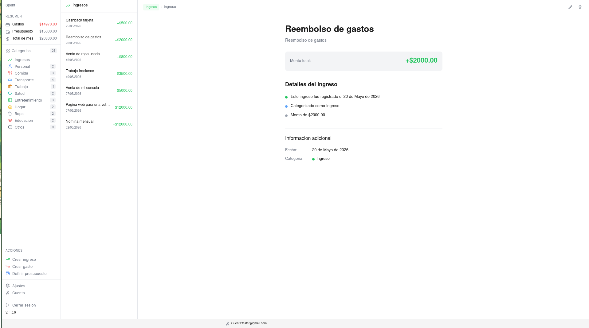

# Spent

Gestion de ingresos y gastos personales. Aplicacion de escritorio gratuita, de codigo abierto y sin conexion a internet requerida.

## Captura



## Caracteristicas

- Registrar gastos e ingresos con titulo, descripcion, categoria y fecha
- Organizar por categorias (Personal, Comida, Transporte, Trabajo, Salud, Entretenimiento, Hogar, Ropa, Educacion, Otros)
- Ver balance en tiempo real
- Filtrar por categoria o por ingresos
- Editar y eliminar transacciones
- Presupuesto mensual
- Exportar datos
- Multiples cuentas

## Stack Tecnologico

| Tecnologia | Uso |
|---|---|
| [Tauri](https://tauri.app) | App de escritorio (Rust + WebView) |
| [Express](https://expressjs.com) | API REST del backend |
| [Bun](https://bun.sh) | Runtime de JavaScript/TypeScript |
| [SQLite](https://sqlite.org) | Base de datos local (via libsql) |
| [TypeScript](https://typescriptlang.org) | Tipado estatico |
| [Vanilla JS](https://developer.mozilla.org/es/docs/Web/JavaScript) | Sin frameworks del lado del cliente |
| [Vite](https://vitejs.dev) | Bundler y dev server del frontend |
| [JWT](https://jwt.io) + [bcrypt](https://github.com/kelektiv/node.bcrypt.js) | Autenticacion |

## Arquitectura

Patron MVC en Express:

```
Cliente (Tauri/Web)
       |
       v
   Routes (Rutas)
       |
       v
 Controller (Logica de negocio)
       |
       v
 Database (SQLite)
```

## Estructura del Proyecto

```
spent/
  src/                   # Frontend
    pages/               # HTML
    styles/              # CSS
    typescript/          # Logica del frontend
      home/              # Modulos de la pantalla principal
  express/               # Backend
    src/
      controllers/       # Logica de negocio (CRUD)
      routes/            # Definicion de rutas API
      types/             # Interfaces TypeScript
      lib/               # Conexion a DB, auth
  src-tauri/             # Configuracion de Tauri (Rust)
```

## Instalacion

### Requisitos

- [Bun](https://bun.sh) >= 1.0
- [Rust](https://rustup.rs) (para compilar con Tauri)
- [Node.js](https://nodejs.org) (opcional, Bun lo reemplaza)

### Pasos

```bash
git clone https://github.com/Gxstavo-dev/spent.git
cd spent
bun install
```

## Ejecutar en Desarrollo

```bash
# Iniciar servidor Express (puerto 3000)
bun run server

# En otra terminal, iniciar frontend con Tauri
bun run tauri dev

# O ambos a la vez
bun run init
```

## Build

```bash
bun run tauri build
```

El ejecutable se genera en `src-tauri/target/release/`.

## Variables de Entorno

Crear un archivo `.env` en `express/`:

```env
PORT=3000
JWT_SECRET=tu_clave_secreta_aqui
```

## API Endpoints

### Usuarios

| Metodo | Ruta | Descripcion |
|---|---|---|
| POST | /usuarios/registro | Crear cuenta |
| POST | /usuarios/login | Iniciar sesion (devuelve JWT) |
| GET | /usuarios/verificar | Verificar si el token es valido |
| GET | /usuarios/mi-cuenta | Obtener datos del usuario |
| PUT | /usuarios/cambiar-nombre | Actualizar nombre |
| PUT | /usuarios/cambiar-contrasena | Cambiar contrasena |

### Transacciones

| Metodo | Ruta | Descripcion |
|---|---|---|
| POST | /transacciones/ingreso | Crear ingreso |
| GET | /transacciones/ingresos | Listar ingresos |
| PUT | /transacciones/ingreso/:id | Actualizar ingreso |
| DELETE | /transacciones/ingreso/:id | Eliminar ingreso |
| POST | /transacciones/gasto | Crear gasto |
| GET | /transacciones/gastos | Listar gastos (?categoria=) |
| PUT | /transacciones/gasto/:id | Actualizar gasto |
| DELETE | /transacciones/gasto/:id | Eliminar gasto |
| GET | /transacciones/gastos/conteo | Contar gastos por categoria |
| GET | /transacciones/resumen | Resumen del mes actual (?categoria=) |
| POST | /transacciones/presupuesto | Crear o actualizar presupuesto |
| DELETE | /transacciones/datos | Eliminar todos los datos del usuario |

## Licencia

MIT License - ver [LICENSE](LICENSE).

---

Creado por [Gxstavo-dev](https://github.com/Gxstavo-dev)
